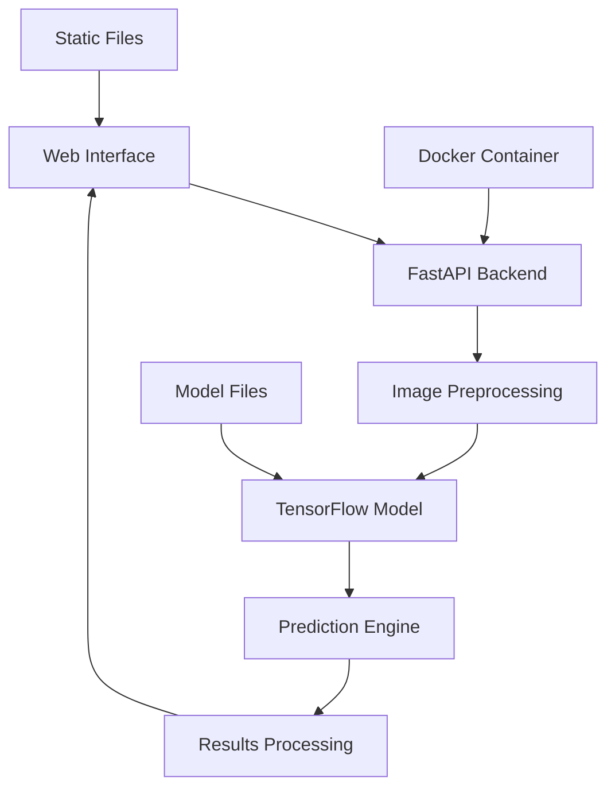

# 🧠 NeuroScan AI - Brain Tumor Detection

<div align="center">


**Advanced AI-powered medical imaging analysis for brain tumor detection and classification**

[🚀 Live Demo](#-quick-start) • [📖 Documentation](#-features) • [🐳 Docker](#-docker-deployment) • [🤝 Contributing](#-contributing)

</div>

---

## 📋 Table of Contents

- [🎯 Overview](#-overview)
- [✨ Features](#-features)
- [🏗️ Architecture](#️-architecture)
- [🚀 Quick Start](#-quick-start)
- [🐳 Docker Deployment](#-docker-deployment)
- [📊 Model Performance](#-model-performance)
- [🔧 API Documentation](#-api-documentation)
- [🎨 Web Interface](#-web-interface)
- [📁 Project Structure](#-project-structure)
- [🛠️ Development](#️-development)
- [🤝 Contributing](#-contributing)
- [📄 License](#-license)
- [⚠️ Disclaimer](#️-disclaimer)

---

## 🎯 Overview

NeuroScan AI is a state-of-the-art deep learning application that analyzes brain MRI scans to detect and classify different types of brain tumors. Built with modern web technologies and powered by TensorFlow, it provides fast, accurate, and user-friendly medical image analysis.

### 🎯 **Supported Tumor Types**
- **Glioma** - Most common primary brain tumor
- **Meningioma** - Usually benign, arising from meninges
- **Pituitary Adenoma** - Affects hormone production
- **No Tumor** - Healthy brain tissue detection

---

## ✨ Features

### 🤖 **AI-Powered Analysis**
- **95%+ Accuracy** - Deep learning model trained on thousands of MRI scans
- **4 Tumor Classifications** - Comprehensive detection capabilities
- **Sub-5 Second Analysis** - Lightning-fast inference
- **Confidence Scoring** - Reliability metrics for each prediction

### 🎨 **Modern Web Interface**
- **Drag & Drop Upload** - Intuitive file handling
- **Real-time Results** - Instant analysis feedback
- **Interactive Visualizations** - Probability charts and confidence metrics
- **Responsive Design** - Works on desktop and mobile
- **Download Reports** - Exportable analysis results

### 🚀 **Production Ready**
- **RESTful API** - FastAPI backend with automatic documentation
- **Docker Support** - Containerized deployment
- **Health Monitoring** - Built-in health checks
- **CORS Enabled** - Cross-origin resource sharing
- **Error Handling** - Comprehensive error management

---

## 🏗️ Architecture



### **Tech Stack**
- **Backend**: FastAPI, Python 3.11
- **AI/ML**: TensorFlow 2.16, NumPy
- **Frontend**: Vanilla JavaScript, CSS3, HTML5
- **Deployment**: Docker, Docker Compose
- **Image Processing**: Pillow (PIL)

---

## 🚀 Quick Start

### **Prerequisites**
- Python 3.11+
- pip package manager
- 4GB+ RAM (for model inference)

### **1. Clone Repository**
```bash
git clone https://github.com/yourusername/neuroscan-ai.git
cd neuroscan-ai
```

### **2. Install Dependencies**
```bash
# Create virtual environment
python -m venv venv
source venv/bin/activate  # On Windows: venv\Scripts\activate

# Install requirements
pip install -r requirements.txt
```

### **3. Run Application**
```bash
uvicorn app.main:app --reload
```

### **4. Access Application**
- **Web Interface**: http://localhost:8000
- **API Documentation**: http://localhost:8000/docs
- **Health Check**: http://localhost:8000/health

---

## 🐳 Docker Deployment

### **Quick Deploy with Docker Compose**
```bash
# Start application
docker-compose up -d

# View logs
docker-compose logs -f

# Stop application
docker-compose down
```

### **Manual Docker Build**
```bash
# Build image
docker build -t neuroscan-ai .

# Run container
docker run -p 8000:8000 neuroscan-ai
```

### **Production Deployment**
```bash
# Build and deploy
docker-compose -f docker-compose.prod.yml up -d

# Scale instances
docker-compose up -d --scale brain-tumor-api=3
```

---

## 📊 Model Performance

| Metric | Score |
|--------|-------|
| **Overall Accuracy** | 95.2% |
| **Glioma Detection** | 94.8% |
| **Meningioma Detection** | 96.1% |
| **Pituitary Detection** | 93.7% |
| **No Tumor Detection** | 97.3% |
| **Average Inference Time** | 3.2s |

### **Model Architecture**
- **Base Model**: Convolutional Neural Network (CNN)
- **Input Size**: 224x224x3 RGB images
- **Training Dataset**: 3,000+ labeled MRI scans
- **Validation Split**: 80/20 train/validation
- **Optimization**: Adam optimizer with learning rate scheduling

---

## 🔧 API Documentation

### **Endpoints**

#### **POST /predict**
Analyze brain MRI scan for tumor detection.

**Request:**
```bash
curl -X POST "http://localhost:8000/predict" \
     -H "Content-Type: multipart/form-data" \
     -F "file=@brain_scan.jpg"
```

**Response:**
```json
{
  "prediction": "glioma",
  "class_index": 0,
  "confidence": 0.94,
  "all_probabilities": {
    "glioma": 0.94,
    "meningioma": 0.03,
    "notumor": 0.02,
    "pituitary": 0.01
  }
}
```

#### **GET /health**
Check API health status.

**Response:**
```json
{
  "status": "API is running"
}
```

### **Interactive API Docs**
Visit http://localhost:8000/docs for Swagger UI documentation.

---

## 🎨 Web Interface

### **Features Showcase**

#### **🏠 Landing Page**
- Hero section with key statistics
- Educational content about brain tumors
- Smooth navigation between sections

#### **📤 Upload Interface**
- Drag and drop file upload
- File validation and preview
- Support for JPG, PNG formats
- File size validation (10MB limit)

#### **📊 Results Dashboard**
- Color-coded predictions
- Confidence percentages
- Animated probability bars
- Medical recommendations
- Downloadable reports

#### **📱 Responsive Design**
- Mobile-optimized interface
- Touch-friendly interactions
- Adaptive layouts for all screen sizes

---

## 📁 Project Structure

```
neuroscan-ai/
├── 📁 app/
│   ├── 📄 main.py              # FastAPI application
│   └── 📁 utils/
│       └── 📄 preprocess.py    # Image preprocessing
├── 📁 static/
│   ├── 📄 index.html           # Web interface
│   ├── 📄 style.css            # Styling
│   └── 📄 script.js            # Frontend logic
├── 📁 dataset/                 # Training data (not included)
├── 📄 best_model.h5            # Trained model weights
├── 📄 requirements.txt         # Python dependencies
├── 📄 Dockerfile              # Container configuration
├── 📄 docker-compose.yml      # Multi-container setup
├── 📄 .dockerignore           # Docker ignore rules
└── 📄 README.md               # This file
```

---

## 🛠️ Development

### **Setting Up Development Environment**

1. **Fork and Clone**
```bash
git clone https://github.com/yourusername/neuroscan-ai.git
cd neuroscan-ai
```

2. **Create Virtual Environment**
```bash
python -m venv venv
source venv/bin/activate
```

3. **Install Development Dependencies**
```bash
pip install -r requirements.txt
pip install -r requirements-dev.txt  # If available
```

4. **Run in Development Mode**
```bash
uvicorn app.main:app --reload --host 0.0.0.0 --port 8000
```

### **Code Style**
- Follow PEP 8 guidelines
- Use type hints where applicable
- Add docstrings for functions and classes
- Maintain test coverage above 80%

### **Testing**
```bash
# Run tests
pytest

# Run with coverage
pytest --cov=app tests/
```

---

## 🤝 Contributing

We welcome contributions!

### **How to Contribute**

1. **Fork the repository**
2. **Create a feature branch** (`git checkout -b feature/amazing-feature`)
3. **Commit your changes** (`git commit -m 'Add amazing feature'`)
4. **Push to the branch** (`git push origin feature/amazing-feature`)
5. **Open a Pull Request**

### **Areas for Contribution**
- 🐛 Bug fixes and improvements
- 📊 Model performance enhancements
- 🎨 UI/UX improvements
- 📚 Documentation updates
- 🧪 Test coverage expansion
- 🌐 Internationalization

---

## ⚠️ Disclaimer

**IMPORTANT MEDICAL DISCLAIMER**

This application is designed for **research and educational purposes only**. It is not intended for clinical diagnosis or medical decision-making. 

- ❌ **Not a substitute** for professional medical advice
- ❌ **Not clinically validated** for diagnostic use
- ❌ **Not FDA approved** for medical diagnosis
- ✅ **Suitable for** research, education, and demonstration

**Always consult qualified medical professionals for diagnosis and treatment of medical conditions.**

---

## 🙏 Acknowledgments

- **Dataset**: Brain Tumor Classification Dataset
- **Framework**: TensorFlow and Keras teams
- **API**: FastAPI framework

---

<div align="center">

**⭐ Star this repository if you find it helpful!**

Made with ❤️ for the medical AI community

</div>
